#****The Same-Origin Policy****#
同源策略
###Eunsuk Kang, Santiago Perez De Rosso, and Daniel Jackson###

>Eunsuk Kang is a PhD candidate and a member of the Software Design Group at MIT. He received his SM (Master of Science) in Computer Science from MIT (2010), and a Bachelor of Software Engineering from the University of Waterloo (2007). His research projects have focused on developing tools and techniques for software modeling and verification, with applications to security and safety-critical systems.

>Eunsuk Kang是麻省理工学院软件设计小组的博士生导师。他获得麻省理工学院计算机科学硕士学位（2010年）和滑铁卢大学软件工程学士学位（2007年）。他的研究项目专注于开发用于软件建模和验证的工具和技术，并将其应用于安全和安全关键系统。

>Santiago Perez De Rosso is a PhD student in the Software Design Group at MIT. He received his SM in Computer Science from MIT (2015), and an undergraduate degree from ITBA (2011). He used to work at Google, developing frameworks and tools to make engineers more productive (2012). He currently spends most of his time thinking about design and version control.

>Santiago Perez De Rosso是麻省理工学院软件设计小组的博士生。他从麻省理工学院（2015）获得计算机科学硕士学位，2011年获得ITBA本科学位。他曾经在Google工作，开发框架和工具，使工程师更有成效（2012）。他目前大部分时间都在思考设计和版本控制。

>Daniel Jackson is a professor in the Department of Electrical Engineering and Computer Science at MIT, and leads the Software Design Group in the Computer Science and Artificial Intelligence Laboratory. He received an MA from Oxford University (1984) in Physics, and his SM (1988) and PhD (1992) in Computer Science from MIT. He was a software engineer for Logica UK Ltd. (1984-1986), Assistant Professor of Computer Science at Carnegie Mellon University (1992-1997), and has been at MIT since 1997. He has broad interests in software engineering, especially in development methods, design and specification, formal methods, and safety critical systems.

>Daniel Jackson是麻省理工学院电气工程与计算机科学系教授，领导计算机科学与人工智能实验室的软件设计小组。他获得了牛津大学（1984年）物理学硕士学位，以及麻省理工学院计算机科学学士学位（1988年）和博士（1992年）博士学位。他是Logica UK Ltd（1984 - 1986年）的软件工程师，卡内基梅隆大学计算机科学助理教授（1992-1997），自1997年以来一直在麻省理工学院，他对软件工程，特别是在开发中具有广泛的兴趣方法，设计和规范，正式方法和安全关键系统。

###Introduction###

介绍

The same-origin policy (SOP) is an important part of the security mechanism of every modern browser. It controls when scripts running in a browser can communicate with one another (roughly, when they originate from the same website). First introduced in Netscape Navigator, the SOP now plays a critical role in the security of web applications; without it, it would be far easier for a malicious hacker to peruse your private photos on Facebook, read your email, or empty your bank account.

同源策略（SOP）是每个现代浏览器安全机制的重要组成部分。它控制在浏览器中运行的脚本可以彼此通信（大致来自同一网站）。首先在Netscape Navigator中引入，SOP现在在Web应用程序的安全性中起着至关重要的作用; 没有它，恶意骇客在Facebook上仔细阅读您的私人照片，阅读您的电子邮件或清空您的银行帐户将更容易。

But the SOP is far from perfect. At times, it is too restrictive; there are cases (such as mashups) in which scripts from different origins should be able to share a resource but cannot. At other times it is not restrictive enough, leaving corner cases that can be exploited using common attacks such as cross-site request forgery. Furthermore, the design of the SOP has evolved organically over the years and puzzles many developers.

但是SOP远非完美。有时，它太限制了; 有些情况（如mashup），其中来自不同来源的脚本应该能够共享资源但不能。在其他时候它没有足够的限制，留下可以利用跨站点请求伪造等常见攻击的角色情况。此外，SOP的设计已经有机地发展，并且使许多开发人员困惑不解。

The goal of this chapter is to capture the essence of this important—yet often misunderstood—feature. In particular, we will attempt to answer the following questions:

本章的目标是捕捉这个重要而又经常被误解的特征的本质。特别是我们将尝试回答以下问题：

- Why is the SOP necessary? What are the types of security violations that it prevents?
- 为什么需要SOP？它阻止的安全违规类型是什么？
- How is the behavior of a web application affected by the SOP?
- Web应用程序的行为如何受到SOP的影响？
- What are different mechanisms for bypassing the SOP?
- 绕过SOP有什么不同的机制？
- How secure are these mechanisms? What are potential security issues that they introduce?
- 这些机制有多安全？他们介绍的潜在安全问题是什么？

Covering the SOP in its entirety is a daunting task, given the complexity of the parts that are involved—web servers, browsers, HTTP, HTML documents, client-side scripts, and so on. We would likely get bogged down by the gritty details of all these parts (and consume our 500 lines before even reaching SOP). But how can we hope to be precise without representing crucial details?

考虑到所涉及的部分的复杂性 - Web服务器，浏览器，HTTP，HTML文档，客户端脚本等，整体覆盖SOP是一项艰巨的任务。我们可能会被所有这些部件的粗细细节陷入僵局（并且在甚至达到SOP之前消耗了500条线）。但是，如果没有代表关键的细节，我们怎么能做到精准呢？

###Modeling with Alloy###
合金建模

This chapter is somewhat different from others in this book. Instead of building a working implementation, we will construct an executable model that serves as a simple yet precise description of the SOP. Like an implementation, the model can be executed to explore dynamic behaviors of the system, but unlike an implementation, the model omits low-level details that may get in the way of understanding the essential concepts.

本章与本书中的其他内容有所不同。我们将构建一个可执行模型，而不是构建一个工作的实现，作为一个简单而精确的SOP描述。像一个实现一样，可以执行该模型来探索系统的动态行为，但与实现不同，该模型忽略了可能妨碍基本概念的低级细节。

The approach we take might be called “agile modeling” because of its similarities to agile programming. We work incrementally, assembling the model bit by bit. Our evolving model is at every point something that can be executed. We formulate and run tests as we go, so that by the end we have not only the model itself but also a collection of properties that it satisfies.

我们采取的方法可能被称为“敏捷建模”，因为它与敏捷编程的相似之处。我们逐步工作，逐一组装模型。我们不断发展的模式在每一个点都可以执行。我们在制定和运行测试时，所以最终我们不仅拥有模型本身，还包含了它所满足的属性集合。

To construct this model, we use Alloy, a language for modeling and analyzing software design. An Alloy model cannot be executed in the traditional sense of program execution. Instead, a model can be (1) simulated to produce an instance, which represents a valid scenario or configuration of a system, and (2) checked to see whether the model satisfies a desired property.

为了构建这个模型，我们使用Alloy，一种用于建模和分析软件设计的语言。合金模型不能以传统的程序执行方式执行。相反，模型可以（1）模拟以产生表示系统的有效场景或配置的实例，以及（2）检查以查看模型是否满足期望的属性。

Despite the above similarities, agile modeling differs from agile programming in one key respect: Although we'll be running tests, we actually won't be writing any. Alloy's analyzer generates test cases automatically, and all that needs to be provided is the property to be checked. Needless to say, this saves a lot of trouble (and text). The analyzer actually executes all possible test cases up to a certain size (called a scope); this typically means generating all starting states with at most some number of objects, and then choosing operations and arguments to apply up to some number of steps. Because so many tests (typically billions) are executed, and because all possible configurations that a state can take are covered (albeit within the scope), this analysis tends to expose bugs more effectively than conventional testing (and is sometimes described as "bounded verification").

尽管有上述的相似之处，敏捷建模与敏捷编程在一个关键方面有所不同：虽然我们将会运行测试，但我们实际上并不会写任何内容。 Alloy的分析仪自动生成测试用例，需要提供的所有测试用例都是要检查的属性。 不用说，这节省了很多麻烦（和文字）。 分析器实际上执行所有可能的测试用例，直到一定大小（称为范围）; 这通常意味着产生具有最多一些数量的对象的所有起始状态，然后选择操作和参数来应用多个步骤。 由于执行了许多测试（通常是数十亿次），并且由于所有可能的状态可能会被配置（尽管范围内）被覆盖，所以这种分析倾向于比常规测试更有效地显示错误（并且有时被称为“有界验证“）。

###Simplifications###
简化

Because the SOP operates in the context of browsers, servers, HTTP, and so on, a complete description would be overwhelming. So our model (like all models) abstracts away irrelevant aspects, such as how network packets are structured and routed. But it also simplifies some relevant aspects, which means that the model cannot fully account for all possible security vulnerabilities.

由于SOP在浏览器，服务器，HTTP等环境中运行，所以完整的描述将是压倒性的。因此，我们的模型（如所有模型）抽象出不相关的方面，例如网络数据包的结构和路由。但它也简化了一些相关方面，这意味着该模型不能完全解决所有可能的安全漏洞。

For example, we treat HTTP requests like remote procedure calls, ignoring the fact that responses to requests might come out of order. We also assume that DNS (the domain name service) is static, so we cannot consider attacks in which a DNS binding changes during an interaction. In principle, though, it would be possible to extend our model to cover all these aspects, although it's in the very nature of security analysis that no model (even if it represents the entire codebase) can be guaranteed to be complete.

例如，我们将HTTP请求视为远程过程调用，忽略了对请求的响应可能会出错的事实。我们还假设DNS（域名服务）是静态的，所以我们不能考虑在交互过程中DNS绑定变化的攻击。原则上，尽管这样做可以扩展我们的模型来涵盖所有这些方面，尽管在安全分析的本质上，没有模型（即使它代表整个代码库）也可以被保证是完整的。

###Roadmap###
路线图

Here is the order in which we will proceed with our model of the SOP. We will begin by building models of three key components that we need in order for us to talk about the SOP: HTTP, the browser, and client-side scripting. We will build on top of these basic models to define what it means for a web application to be secure, and then introduce the SOP as a mechanism that attempts to achieve the required security properties.

以下是我们将继续使用我们的SOP模型的顺序。我们将首先构建我们需要的三个关键组件的模型，以便我们讨论SOP：HTTP，浏览器和客户端脚本。我们将建立在这些基本模型之上，以定义Web应用程序的安全性意义，然后将SOP作为尝试实现所需安全属性的机制。

We will then see that the SOP can sometimes be too restrictive, getting in the way of a web application's proper functioning. So we will introduce four different techniques that are commonly used to bypass the restrictions that are imposed by the policy.

然后，我们将看到SOP有时可能太限制，阻碍了Web应用程序的正常运行。因此，我们将介绍四种不同的技术，通常用于绕过策略强加的限制。

Feel free to explore the sections in any order you'd like. If you are new to Alloy, we recommend starting with the first three sections (HTTP, Browser, and Script), as they introduce some of the basic concepts of the modeling language. While you are making your way through the chapter, we also encourage you to play with the models in the Alloy Analyzer; run them, explore the generated scenarios, and try making modifications and seeing their effects. It is freely available for download.

随意浏览您想要的任何顺序的部分。如果您是Alloy的新人，我们建议从前三部分（HTTP，浏览器和脚本）开始，因为它们介绍了建模语言的一些基本概念。在您阅读本章的过程中，我们还鼓励您使用合金分析仪中的型号; 运行它们，探索生成的场景，并尝试修改并查看其效果。它可以免费下载。

###Model of the Web###
###HTTP###
网络模型

HTTP

The first step in building an Alloy model is to declare some sets of objects. Let's start with resources:

构建合金模型的第一步是声明一些对象。我们从资源开始：

    sig Resource {}
The keyword sig identifies this as an Alloy signature declaration. This introduces a set of resource objects; think of these, just like the objects of a class with no instance variables, as blobs that have identity but no content. When the analysis runs, this set will be determined, just as a class in an object-oriented language comes to denote a set of objects when the program executes.

该关键字将其sig标识为合金签名声明。这引入了一组资源对象; 想到这些，就像没有实例变量的类的对象一样，作为具有身份但没有内容的blob。当分析运行时，该集合将被确定，正如面向对象语言中的类在程序执行时表示一组对象时一样。

Resources are named by URLs (uniform resource locators):

Resources由URL（统一资源定位符）命名：
    
    sig Url {
      protocol: Protocol,
      host: Domain,
      port: lone Port,
      path: Path
    }
    sig Protocol, Port, Path {}
    sig Domain { subsumes: set Domain }
Here we have five signature declarations, introducing a set of URLs and four additional sets for each of the basic kinds of objects they comprise. Within the URL declaration, we have four fields. Fields are like instance variables in a class; if `u` is a URL, for example, then `u.protocol` would represent the protocol of that URL (just like dot in Java). But in fact, as we'll see later, these fields are relations. You can think of each one as if it were a two-column database table. Thus `protocol` is a table with the first column containing URLs and the second column containing protocols. And the innocuous looking dot operator is in fact a rather general kind of relational join, so that you could also write `protocol.p` for all the URLs with a protocol `p`—but more on that later.

这里我们有五个签名声明，为每个基本类型的对象引入一组URL和四个附加集合。在URL声明中，我们有四个字段。字段与类中的实例变量类似; u例如，如果是URL，则表示该URL u.protocol的协议（就像Java中的点）。但事实上，我们稍后会看到，这些领域是关系。您可以将每个人都想像为两列数据库表。因此，protocol这是一个表，第一列包含URL，第二列包含协议。而无害的点操作符实际上是一种相当一般的关系连接，所以你也可以protocol.p使用一个协议来编写所有的URL，p但是后面还有更多的。

Note that paths, unlike URLs, are treated as if they have no structure—a simplification. The keyword `lone` (which can be read "less than or equal to one") says that each URL has at most one port. The path is the string that follows the host name in the URL, and which (for a simple static server) corresponds to the file path of the resource; we're assuming that it's always present, but can be an empty path.

请注意，与URL不同的路径被视为没有结构 - 简化。关键字lone（可以读取“小于等于1”）表示每个URL最多只有一个端口。路径是跟随URL中主机名的字符串，哪个（对于简单的静态服务器）对应于resources的文件路径; 我们假设它总是存在，但可以是一个空的路径。

Let us introduce clients and servers, each of which contains a mapping from paths to resources:

我们介绍客户端和服务器，每个客户端和服务器都包含从路径到resources的映射：

    abstract sig Endpoint {}
    abstract sig Client extends Endpoint {}
    abstract sig Server extends Endpoint {
      resources: Path -> lone Resource
    }
The extends keyword introduces a subset, so the set `Client` of all clients, for example, is a subset of the set `Endpoint` of all endpoints. Extensions are disjoint, so no endpoint is both a client and a server. The `abstract` keyword says that all extensions of a signature exhaust it, so its occurrence in the declaration of `Endpoint`, for example, says that every endpoint must belong to one of the subsets (at this point, `Client` and `Server`). For a server s, the expression `s.resources` will denote a map from paths to resources (hence the arrow in the declaration). Recall that each field is actually a relation that includes the owning signature as a first column, so this field represents a three-column relation on `Server`, `Path` and `Resource`.

该extends关键字引入了一个子集，所以Client例如所有客户端的集合Endpoint是所有端点集合的一个子集。扩展是不相交的，所以任何端点都不是客户端和服务器。该abstract关键字说，签名的所有扩展耗尽，所以它在声明发生Endpoint，例如说，每个端点必须属于一个子集（在这一点上，Client和Server）。对于服务器s，表达式s.resources将表示从路径到resources（因此声明中的箭头）的映射。回想一下，每个字段实际上是包括拥有签名作为第一列的关系，所以此字段表示在一个三列的关系Server，Path和Resource。

To map a URL to a server, we introduce a set `Dns` of domain name servers, each with a mapping from domains to servers:

要将URL映射到服务器，我们引入一组Dns域名服务器，每个服务器都具有从域到服务器的映射：

    one sig Dns {
      map: Domain -> Server
    }
The keyword `one` in the signature declaration means that (for simplicity) we're going to assume exactly one domain name server, and there will be a single DNS mapping, given by the expression `Dns.map`. Again, as with the serving resources, this could be dynamic (and in fact there are known security attacks that rely on changing DNS bindings during an interaction) but we're simplifying.

one签名声明中的关键字意味着（为了简单起见），我们将假定只有一个域名服务器，并且将由表达式给出单个DNS映射Dns.map。再次，与服务资源一样，这可能是动态的（事实上，已知的安全攻击依赖于交互期间更改DNS绑定），但我们正在简化。

In order to model HTTP requests, we also need the concept of cookies, so let's declare them:

为了建模HTTP请求，我们还需要cookie的概念，所以让我们来声明一下：

    sig Cookie {
      domains: set Domain
    }
Each cookie is scoped with a set of domains; this captures the fact that a cookie can apply to `*.mit.edu`, which would include all domains with the suffix `mit.edu`.

每个cookie的范围是一组域名; 这将捕获一个cookie可以应用到的事实*.mit.edu，其中包括具有后缀的所有域mit.edu。

Finally, we can put this all together to construct a model of HTTP requests:

最后，我们可以将它们放在一起构建一个HTTP请求的模型：

    abstract sig HttpRequest extends Call {
      url: Url,
      sentCookies: set Cookie,
      body: lone Resource,
      receivedCookies: set Cookie,
      response: lone Resource,
    }{
      from in Client
      to in Dns.map[url.host]
    }
We're modeling an HTTP request and response in a single object; the `url`, `sentCookies` and `body` are sent by the client, and the `receivedCookies` and `response` are sent back by the server.

我们正在对单个对象中的HTTP请求和响应进行建模; 的url，sentCookies并且body由客户端发送，receivedCookies并response发送回服务器。

When writing the `HttpRequest` signature, we found that it contained generic features of calls, namely that they are from and to particular things. So we actually wrote a little Alloy module that declares the `Call` signature, and to use it here we need to import it:

在写HttpRequest签名的时候，我们发现它包含了通用的通话功能，即它们来自特定的东西。所以我们实际上写了一个声明Call签名的小合金模块，并在这里使用它，我们需要导入它：

    open call[Endpoint]
It's a polymorphic module, so it's instantiated with `Endpoint`, the set of things calls are from and to. (The module appears in full in Appendix: Reusing Modules in Alloy.)

它是一个多态模块，所以它被实例化Endpoint，一组调用来自和到。（该模块全部显示在“合金”中的“重新使用模块”中）

Following the field declarations in `HttpRequest` is a collection of constraints. Each of these constraints applies to all members of the set of HTTP requests. The constraints say that (1) each request comes from a client, and (2) each request is sent to one of the servers specified by the URL host under the DNS mapping.

跟踪字段声明HttpRequest是一个约束集合。这些约束中的每一个都适用于HTTP请求集合中的所有成员。约束条件是：（1）每个请求都来自一个客户端，（2）每个请求被发送到由DNS主机根据DNS映射指定的一个服务器。

One of the prominent features of Alloy is that a model, no matter how simple or detailed, can be executed at any time to generate sample system instances. Let's use the `run` command to ask the Alloy Analyzer to execute the HTTP model that we have so far:

Alloy的一个突出特点是可以随时执行一个模型，无论多么简单或详细，以生成示例系统实例。让我们使用这个run命令来要求合金分析器执行到目前为止的HTTP模型：

    run {} for 3-- generate an instance with up to 3 objects of every signature type
As soon as the analyzer finds a possible instance of the system, it automatically produces a diagram of the instance, like in Figure 17.1.

一旦分析仪找到系统的可能实例，它就会自动生成一个实例的图，如图17.1所示。

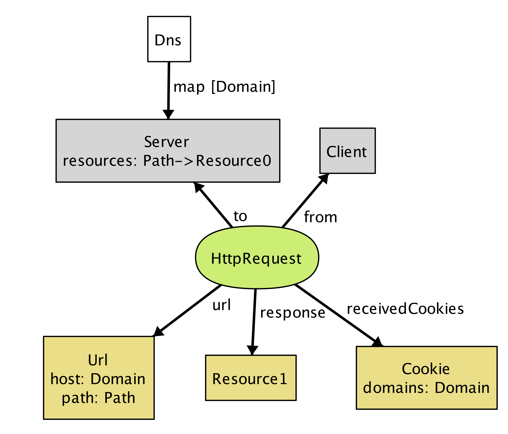

This instance shows a client (represented by node `Client`) sending an `HttpRequest` to `Server`, which, in response, returns a resource object and instructs the client to store `Cookie` at `Domain`.

此实例示出了客户机（由节点表示Client）发送HttpRequest到Server，其作为响应，返回一个资源对象，并指示客户端存储Cookie在Domain。

Even though this is a tiny instance with seemingly few details, it signals a flaw in our model. Note that the resource returned from the request (`Resource1`) does not exist in the server. We neglected to specify an obvious fact about the server; namely, that every response to a request is a resource that the server stores. We can go back to our definition of `HttpRequest` and add a constraint:

即使这是一个看似细节的细微的例子，它表明了我们的模型中的一个缺陷。请注意，从请求（Resource1）返回的资源不存在于服务器中。我们忽略了一个关于服务器的明显事实; 即，对请求的每个响应都是服务器存储的资源。我们可以回到我们的定义HttpRequest并添加一个约束：

    abstract sig HttpRequest extends Call { ... }{
      ...
      response = to.resources[url.path]
    }
Rerunning now produces instances without the flaw.

重新运行现在产生没有缺陷的实例。

Instead of generating sample instances, we can ask the analyzer to check whether the model satisfies a property. For example, one property we might want is that when a client sends the same request multiple times, it always receives the same response back:

而不是生成样本实例，我们可以要求分析器检查模型是否满足属性。例如，我们可能需要的一个属性是当客户端多次发送相同的请求时，它总是收到相同的响应：

    check { 
    all r1, r2: HttpRequest | r1.url = r2.url implies r1.response = r2.response 
    } for 3 
Given this check command, the analyzer explores every possible behavior of the system (up to the specified bound), and when it finds one that violates the property, displays that instance as a counterexample, as shown in Figure 17.2 and Figure 17.3.

给定此check命令，分析器会探测系统的所有可能的行为（直到指定的边界），并且当它找到违反该属性的行为时，将该实例显示为反例，如图17.2和图17.3所示。

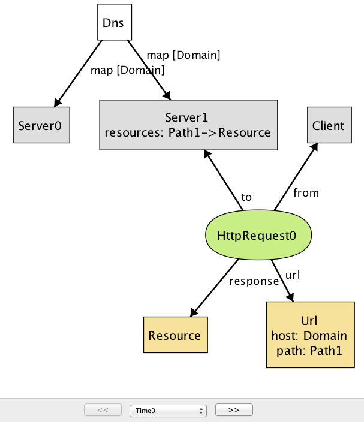

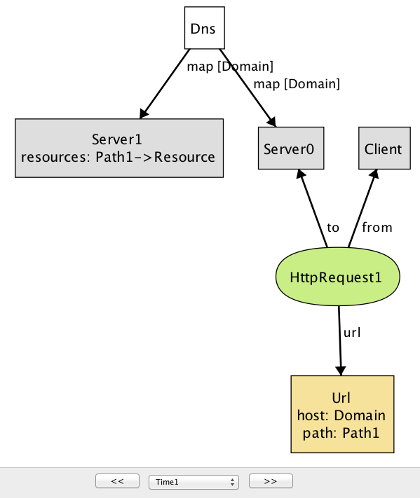

This counterexample again shows an HTTP request being made by a client, but with two different servers. (In the Alloy visualizer, objects of the same type are distinguished by appending numeric suffixes to their names; if there is only one object of a given type, no suffix is added. Every name that appears in a snapshot diagram is the name of an object. So—perhaps confusingly at first sight—the names `Domain`, `Path`, `Resource`, `Url` all refer to individual objects, not to types.)

这个反例再次显示了客户端发出的HTTP请求，但是使用了两个不同的服务器。（在合金可视化器中，相同类型的对象通过将数字后缀附加到其名称来区分;如果只有一个给定类型的对象，则不添加任何后缀。快照图中出现的每个名称都是对象。所以，也许混淆的一见钟情，名称Domain，Path，Resource，Url都是指单个对象，而不是类型。）

Note that while the DNS maps `Domain` to both `Server0` and `Server1` (in reality, this is a common practice for load balancing), only `Server1` maps `Path` to a resource object, causing `HttpRequest1` to result in an empty response: another error in our model. To fix this, we add an Alloy fact recording that any two servers to which DNS maps a single host provide the same set of resources:

请注意，虽然DNS映射Domain到两个Server0及Server1（在现实中，这是一个负载均衡的普遍做法），只Server1映射Path到一个资源对象，从而导致HttpRequest1导致空响应：在我们的模型中另一个错误。为了解决这个问题，我们添加了一个Alloy 事实记录，DNS映射单个主机的任何两个服务器提供了相同的资源集合：

    fact ServerAssumption {
      all s1, s2: Server | 
    (some Dns.map.s1 & Dns.map.s2) implies s1.resources = s2.resources
    }
When we re-run the `check` command after adding this fact, the analyzer no longer reports any counterexamples for the property. This doesn't mean the property has been proven to be true, since there might be a counterexample in a larger scope. But it is unlikely that the property is false, since the analyzer has tested all possible instances involving 3 objects of each type.

当我们check在添加这个事实后重新运行命令时，分析器不再报告该属性的任何反例。这并不意味着该属性已被证明是真实的，因为在更大的范围内可能有一个反例。但由于分析仪已经测试了涉及每种类型的3个对象的所有可能的实例，所以属性不可能是假的。

If desired, however, we can re-run the analysis with a larger scope for increased confidence. For example, running the above check with the scope of 10 still does not produce any counterexample, suggesting that the property is likely to be valid. However, keep in mind that given a larger scope, the analyzer needs to test a greater number of instances, and so it will likely take longer to complete.

但是，如果需要，我们可以重新进行更大的分析，以增加信心。例如，使用范围为10的上述检查仍然不产生任何反例，表明该属性可能是有效的。但是，请记住，由于分析仪范围较大，所以分析仪需要测试更多的实例，因此可能需要较长时间才能完成。

### Browser ###

浏览器

Let's now introduce browsers into our model:

现在我们将浏览器介绍到我们的模型中：

    sig Browser extends Client {
      documents: Document -> Time,
      cookies: Cookie -> Time,
    }
This is our first example of a signature with dynamic fields. Alloy has no built-in notions of time or behavior, which means that a variety of idioms can be used. In this model, we're using a common idiom in which you introduce a notion of `Time`, and attach it as a final column for every time-varying field. For example, the expression `b.cookies`.t represents the set of cookies that are stored in browser b at a particular time t. Likewise, the `documents` field associates a set of documents with each browser at a given time. (For more details about how we model the dynamic behavior, see Appendix: Reusing Modules in Alloy.)

这是我们用动态字段签名的第一个例子。合金没有内在的时间或行为的概念，这意味着可以使用各种成语。在这个模型中，我们使用一个常用的成语，您可以在其中引入一个概念Time，并将其作为每个时变字段的最后一列。例如，表达式b.cookies.t表示b在特定时间存储在浏览器中的一组Cookie t。同样，该documents字段在给定时间将一组文档与每个浏览器相关联。（有关如何建模动态行为的更多详细信息，请参阅附录：在合金中重新使用模块。）

Documents are created from a response to an HTTP request. They can also be destroyed if, for example, the user closes a tab or the browser, but we leave this out of the model. A document has a URL (the one from which the document was originated), some content (the DOM), and a domain:

文档是从响应HTTP请求创建的。如果用户关闭选项卡或浏览器，但是我们将其退出模型，也可能会被破坏。一个文件有一个URL（源自该文档的URL），一些内容（DOM）和一个域：

    sig Document {
      src: Url,
      content: Resource -> Time,
      domain: Domain -> Time
    }
The inclusion of the `Time` column for the latter two fields tells us that they can vary over time, and its omission for the first (`src`, representing the source URL of the document) indicates that the source URL is fixed.

Time包含后两个字段的列告诉我们，它们可以随着时间而变化，并且它的第一个（src代表文档的源URL）的省略表示源URL是固定的。

To model the effect of an HTTP request on a browser, we introduce a new signature, since not all HTTP requests will originate at the level of the browser; the rest will come from scripts.

为了建模一个HTTP请求对浏览器的影响，我们引入一个新的签名，因为并不是所有的HTTP请求都将发生在浏览器的级别; 其余的将来自脚本。

    sig BrowserHttpRequest extends HttpRequest {
      doc: Document
    }{
      -- the request comes from a browser
      from in Browser
      -- the cookies being sent exist in the browser at the time of the request
      sentCookies in from.cookies.start
      -- every cookie sent must be scoped to the url of the request
      all c: sentCookies | url.host in c.domains
    
      -- a new document is created to display the content of the response
      documents.end = documents.start + from -> doc
      -- the new document has the response as its contents
      content.end = content.start ++ doc -> response
      -- the new document has the host of the url as its domain
      domain.end = domain.start ++ doc -> url.host
      -- the document's source field is the url of the request
      doc.src = url
    
      -- new cookies are stored by the browser
      cookies.end = cookies.start + from -> sentCookies
    }
This kind of request has one new field, doc, representing the document created in the browser from the resource returned by the request. As with `HttpRequest`, the behavior is described as a collection of constraints. Some of these say when the call can happen: for example, that the call has to come from a browser. Some constrain the arguments of the call: for example, that the cookies must be scoped appropriately. And some constrain the effect, using a common idiom that relates the value of a relation after the call to its value before.

这种请求有一个新的字段，doc表示从请求返回的资源在浏览器中创建的文档。与之HttpRequest一样，行为被描述为约束的集合。其中一些说话可能发生：例如，呼叫必须来自浏览器。一些约束调用的参数：例如，cookie必须适当地作用域。一些约束效果，使用一个共同的成语，将一个关系的值与调用之后的值相关联。

For example, to understand the constraint `documents.end = documents.start + from -> doc` remember that `documents` is a 3-column relation on browsers, documents and times. The fields `start` and `end` come from the declaration of `Call` (which we haven't seen, but is included in the listing at the end), and represent the times at the beginning and end of the call. The expression `documents.end` gives the mapping from browsers to documents when the call has ended. So this constraint says that after the call, the mapping is the same, except for a new entry in the table mapping `from` to `doc`.

例如，要了解约束，documents.end = documents.start + from -> doc记住documents在浏览器，文档和时间上是一个3列的关系。字段start和end来自的声明Call（我们还没有看到，但包括在年底上市），并在通话的开始和结束代表了倍。该表达式documents.end在调用结束时给出了从浏览器到文档的映射。所以这个约束说，在调用之后，映射是相同的，除了表映射from到的新条目之外doc。

Some constraints use the `++` relational *override* operator: `e1 ++ e2` contains all tuples of `e2`, and additionally, any tuples of `e1` whose first element is not the first element of a tuple in e2. For example, the constraint `content.end = content.start ++ doc -> response` says that after the call, the `content` mapping will be updated to map `doc` to `response` (overriding any previous mapping of `doc`). If we were to use the union operator `+` instead, then the same document might (incorrectly) be mapped to multiple resources in the after state.

一些约束使用++关系覆盖运算符：e1 ++ e2包含所有元组e2，并且还包含e1其第一个元素不是元组的第一个元素的任何元组e2。例如，约束content.end = content.start ++ doc -> response说，在调用之后，content映射将被更新以映射doc到response（覆盖任何之前的映射doc）。如果我们要使用联合运算符+，那么相同的文档可能（不正确地）被映射到后面的状态的多个资源。

#### Script ####

脚本

Next, we will build on the HTTP and browser models to introduce client-side scripts, which represent pieces of code (typically in JavaScript) executing inside a browser document (`context`).

接下来，我们将在HTTP和浏览器模型的基础上引入客户端脚本，它们代表在浏览器文档（context）中执行的代码段（通常在JavaScript中）。

    sig Script extends Client { context: Document }
A script is a dynamic entity that can perform two different kinds of action: (1) it can make HTTP requests (i.e., Ajax requests) and (2) it can perform browser operations to manipulate the content and properties of a document. The flexibility of client-side scripts is one of the main catalysts of the rapid development of Web 2.0, but is also the reason why the SOP was created in the first place. Without the SOP, scripts would be able to send arbitrary requests to servers, or freely modify documents inside the browser—which would be bad news if one or more of the scripts turned out to be malicious.

脚本是一个动态实体，可以执行两种不同的动作：（1）它可以使HTTP请求（即Ajax请求）和（2）它可以执行浏览器操作来操纵文档的内容和属性。客户端脚本的灵活性是Web 2.0快速开发的主要催化剂之一，也是SOP创建的原因之一。没有SOP，脚本将能够向服务器发送任意请求，或者自由修改浏览器内的文档 - 如果一个或多个脚本变成恶意软件，这将是坏消息。

A script can communicate to a server by sending an `XmlHttpRequest`:

脚本可以通过发送XmlHttpRequest：

    sig XmlHttpRequest extends HttpRequest {}{
      from in Script
      noBrowserChange[start, end] and noDocumentChange[start, end]
    }
An `XmlHttpRequest` can be used by a script to send/receive resources to/from a server, but unlike `BrowserHttpRequest`, it does not immediately result in the creation of a new page or other changes to the browser and its documents. To say that a call does not modify these aspects of the system, we define predicates `noBrowserChange` and `noDocumentChange`:

一个XmlHttpRequest可以通过脚本中使用从服务器发送/接收的资源/，但不同BrowserHttpRequest，它不会立即导致创建一个新的页面或其他更改浏览器及其文档。要说一个调用不会修改系统的这些方面，我们定义谓词noBrowserChange，并且noDocumentChange：

    pred noBrowserChange[start, end: Time] {
      documents.end = documents.start and cookies.end = cookies.start  
    }
    pred noDocumentChange[start, end: Time] {
      content.end = content.start and domain.end = domain.start  
    }
What kind of operations can a script perform on documents? First, we introduce a generic notion of *browser operations* to represent a set of browser API functions that can be invoked by a script:

脚本在文档上执行什么样的操作？首先，我们引入浏览器操作的通用概念来表示可以由脚本调用的一组浏览器API函数：

    abstract sig BrowserOp extends Call { doc: Document }{
      from in Script and to in Browser
      doc + from.context in to.documents.start
      noBrowserChange[start, end]
    }
Field `doc` refers to the document that will be accessed or manipulated by this call. The second constraint in the signature facts says that both doc and the document in which the script executes (`from.context`) must be documents that currently exist inside the browser. Finally, a `BrowserOp` may modify the state of a document, but not the set of documents or cookies that are stored in the browser. (Actually, cookies can be associated with a document and modified using a browser API, but we omit this detail for now.)

字段doc是指将被该调用访问或操纵的文档。签名事实中的第二个约束表明，doc脚本执行（from.context）的文档和文档都必须是浏览器中当前存在的文档。最后，a BrowserOp可以修改文档的状态，但不能修改存储在浏览器中的一组文档或cookie。（实际上，Cookie可以与文档相关联，并使用浏览器API进行修改，但现在我们略去这个细节。）

A script can read from and write to various parts of a document (usually called DOM elements). In a typical browser, there are a large number of API functions for accessing the DOM (e.g., `document.getElementById`), but enumerating all of them is not important for our purpose. Instead, we will simply group them into two kinds—`ReadDom` and `WriteDom`—and model modifications as wholesale replacements of the entire document:

脚本可以读取和写入文档的各个部分（通常称为DOM元素）。在典型的浏览器中，有大量用于访问DOM的API函数（例如，document.getElementById），但枚举所有这些对于我们的目的来说并不重要。相反，我们将简单地将它们分为两种类型ReadDom和WriteDom模型修改，作为整个文档的批发替换：

    sig ReadDom extends BrowserOp { result: Resource }{
      result = doc.content.start
      noDocumentChange[start, end]
    }
    sig WriteDom extends BrowserOp { newDom: Resource }{
      content.end = content.start ++ doc -> newDom
      domain.end = domain.start
    }
`ReadDom` returns the content of the target document, but does not modify it; `WriteDom`, on the other hand, sets the new content of the target document to `newDom`.

ReadDom返回目标文档的内容，但不修改它; WriteDom另一方面，将目标文档的新内容设置为newDom。

In addition, a script can modify various properties of a document, such as its width, height, domain, and title. For our discussion of the SOP, we are only interested in the domain property, which we will introduce in a later section.

此外，脚本可以修改文档的各种属性，例如其宽度，高度，域和标题。对于我们对SOP的讨论，我们只对域属性感兴趣，我们将在后面的部分中介绍。

### Example Applications ###

示例应用程序

As we've seen earlier, given a `run` or `check` command, the Alloy Analyzer generates a scenario (if it exists) that is consistent with the description of the system in the model. By default, the analyzer arbitrarily picks any one of the possible system scenarios (up to the specified bound), and assigns numeric identifiers to signature instances (`Server0`, `Browser1`, etc.) in the scenario.

如前所述，给定run或check命令，合金分析器会生成与模型中系统描述一致的方案（如果存在）。默认情况下，分析器任意挑选任何的可能的系统方案之一（将在指定的结合），并且分配数字标识符到签名实例（Server0，Browser1等）在方案中。

Sometimes, we may wish to analyze the behavior of a particular web application, instead of exploring scenarios with a random configuration of servers and clients. For example, imagine that we wish to build an email application that runs inside a browser (like Gmail). In addition to providing basic email features, our application might display a banner from a third-party advertisement service, which is controlled by a potentially malicious actor.

有时，我们可能希望分析特定 Web应用程序的行为，而不是通过随机配置服务器和客户端来探索场景。例如，假设我们希望构建一个在浏览器中运行的电子邮件应用程序（如Gmail）。除了提供基本的电子邮件功能外，我们的应用程序可能会显示来自第三方广告服务的横幅，该广告服务由潜在的恶意角色控制。

In Alloy, the keywords `one sig` introduce a singleton signature containing exactly one object; we saw an example above with `Dns`. This syntax can be used to specify concrete atoms. For example, to say that there is one inbox page and one ad banner (each of which is a document) we can write:

在合金中，关键字one sig引入了一个只包含一个对象的单例签名; 我们看到上面的例子Dns。这个语法可以用来指定具体的原子。例如，要说有一个收件箱页面和一个广告横幅（每个都是一个文档），我们可以写：

    one sig InboxPage, AdBanner extends Document {}
With this declaration, every scenario that Alloy generates will contain at least these two `Document` objects.

使用此声明，Alloy生成的每个方案至少包含这两个Document对象。

Likewise, we can specify particular servers, domains and so on, with a constraint (which we've called `Configuration`) to specify the relationships between them:

同样，我们可以指定特定的服务器，域等，并附加一个约束（我们称之为Configuration）来指定它们之间的关系：

    one sig EmailServer, EvilServer extends Server {}
    one sig EvilScript extends Script {}
    one sig EmailDomain, EvilDomain extends Domain {}
    fact Configuration {
      EvilScript.context = AdBanner
      InboxPage.domain.first = EmailDomain
      AdBanner.domain.first = EvilDomain  
      Dns.map = EmailDomain -> EmailServer + EvilDomain -> EvilServer
    }
For example, the last constraint in the fact specifies how the DNS is configured to map domain names for the two servers in our system. Without this constraint, the Alloy Analyzer may generate scenarios where `EmailDomain` is mapped to `EvilServer`, which are not of interest to us. (In practice, such a mapping may be possible due to an attack called DNS spoofing, but we will rule it out from our model since it lies outside the class of attacks that the SOP is designed to prevent.)

例如，事实上的最后一个约束规定了如何配置DNS来映射系统中两台服务器的域名。没有这个约束，合金分析器可能会生成EmailDomain映射到的场景EvilServer，这对我们不感兴趣。（实际上，由于被称为DNS欺骗的攻击，这种映射可能是可能的，但是我们将从我们的模型中排除它，因为它不在SOP旨在防止的攻击类之外。）

Let us introduce two additional applications: an online calendar and a blog site:

我们再介绍两个额外的应用程序：一个在线日历和一个博客站点：
    
    one sig CalendarServer, BlogServer extends Document {} 
    one sig CalendarDomain, BlogDomain extends Domain {}
We should update the constraint about the DNS mapping above to incorporate the domain names for these two servers:

我们应该更新上面的DNS映射的约束以合并这两个服务器的域名：

    fact Configuration {
      ...
      Dns.map = EmailDomain -> EmailServer + EvilDomain -> EvilServer + 
       			CalendarDomain -> CalendarServer + BlogDomain -> BlogServer  
    }
In addition, let us say that that the email, blog, and calendar applications are all developed by a single organization, and thus, share the same base domain name. Conceptually, we can think of `EmailServer` and `CalendarServer` having subdomains `email` and `calendar`, sharing `example.com` as the common superdomain. In our model, this can be represented by introducing a domain name that subsumes others:

另外，让我们说，电子邮件，博客和日历应用程序都是由单个组织开发的，因此共享相同的基础域名。从概念上讲，我们可以想到EmailServer并CalendarServer拥有子域名email，并calendar分享example.com为共同的超级域名。在我们的模型中，这可以通过引入包含其他人的域名来表示：

    one sig ExampleDomain extends Domain {}{
      subsumes = EmailDomain + EvilDomain + CalendarDomain + this
    }   
Note that `this` is included as a member of `subsumes`, since every domain name subsumes itself.

注意，this作为其成员包括subsumes，因为每个域名都包含在内。

There are other details about these applications that we omit here (see `example.als` for the full model). But we will revisit these applications as our running example throughout the remainder of this chapter.

还有关于我们在这里省略的这些应用程序的其他细节（参见example.als完整型号）。但是，我们将在本章的其余部分重新审视这些应用程序作为我们运行的示例。

### Security Properties ###

安全属性

Before we get to the SOP itself, there is an important question that we have not discussed yet: What exactly do we mean when we say our system is *secure*?

在我们进入SOP之前，我们还没有讨论一个重要的问题：当我们说我们的系统是安全的时候，我们的意思是什么？

Not surprisingly, this is a tricky question to answer. For our purposes, we will turn to two well-studied concepts in information security—*confidentiality* and *integrity*. Both of these concepts talk about how information should be allowed to pass through the various parts of the system. Roughly, *confidentiality* means that a critical piece of data should only be accessible to parts that are deemed trusted, and integrity means that trusted parts only rely on data that have not been maliciously tampered with.

毫不奇怪，这是一个棘手的问题来回答。为了我们的目的，我们将转而对信息安全 - 保密和诚信两个精心研究的概念。这两个概念都谈论如何允许信息通过系统的各个部分。大致来说，机密性意味着只有对被认为可信任的部分才能访问关键的数据，而完整性意味着信任的部分只能依赖于没有被恶意篡改的数据。

### Dataflow Properties ###

数据流属性

In order to specify these security properties more precisely, we first need to define what it means for a piece of data to flow from one part of the system to another. In our model so far, we have described interactions between two endpoints as being carried out through *calls*; e.g., a browser interacts with a server by making HTTP requests, and a script interacts with the browser by invoking browser API operations. Intuitively, during each call, a piece of data may flow from one endpoint to another as an argument or *return value of* the call. To represent this, we introduce a notion of `DataflowCall` into the model, and associate each call with a set of `args` and `returns` data fields:

为了更精确地指定这些安全属性，我们首先需要定义一段数据从系统的一部分流向另一部分的意义。在我们的模型中，我们已经描述了两个端点之间的通过通话进行的交互; 例如，浏览器通过发出HTTP请求与服务器交互，脚本通过调用浏览器API操作与浏览器进行交互。直观地，在每个呼叫期间，一条数据可以作为呼叫的参数或返回值从一个端点流向另一端点。为了表示这一点，我们引入一个概念DataflowCall到模型中，并将每个调用与一组args和returns数据字段相关联：

    sig Data in Resource + Cookie {}
    
    sig DataflowCall in Call {
      args, returns: set Data,  --- arguments and return data of this call
    }{
     this in HttpRequest implies
    	args = this.sentCookies + this.body and
       	returns = this.receivedCookies + this.response
     ...
    }
For example, during each call of type `HttpRequest`, the client transfers `sentCookies` and `body` to the server, and receives `receivedCookies` and `response` as return values.

例如，在每次呼叫类型HttpRequest时，客户端都会传输sentCookies和body传输到服务器，并接收receivedCookies和response返回值。

More generally, arguments flow from the sender of the call to the receiver, and return values flow from the receiver to the sender. This means that the only way for an endpoint to access a new piece of data is by receiving it as an argument of a call that the endpoint accepts, or a return value of a call that the endpoint invokes. We introduce a notion of `DataflowModule`, and assign field `accesses` to represent the set of data elements that the module can access at each time step:

更一般地，参数从呼叫的发送者流向接收者，并返回值从接收者到发送者的流。这意味着端点访问新数据的唯一方法是将其作为端点接受的调用的参数或端点调用的调用的返回值接收。我们引入一个概念DataflowModule，并分配字段accesses来表示在每个时间步长模块可以访问的数据元素集合：
    
    sig DataflowModule in Endpoint {
      -- Set of data that this component initially owns
      accesses: Data -> Time
    }{
      all d: Data, t: Time - first |
     -- This endpoint can only access a piece of data "d" at time "t" only when
    d -> t in accesses implies
      -- (1) It already had access in the previous time step, or
      d -> t.prev in accesses or
      -- there is some call "c" that ended at "t" such that
      some c: Call & end.t |
    -- (2) the endpoint receives "c" that carries "d" as one of its arguments or
    c.to = this and d in c.args or
    -- (3) the endpoint sends "c" that returns "d" 
    c.from = this and d in c.returns 
    }
We also need to restrict data elements that a module can provide as arguments or return values of a call. Otherwise, we may get weird scenarios where a module can make a call with an argument that it has no access to.

我们还需要限制模块可以提供的数据元素作为参数或返回值。否则，我们可能会遇到一个奇怪的情况，一个模块可以使用无法访问的参数进行调用。

    sig DataflowCall in Call { ... } {
      -- (1) Any arguments must be accessible to the sender
      args in from.accesses.start
      -- (2) Any data returned from this call must be accessible to the receiver
      returns in to.accesses.start
    }
Now that we have means to describe data flow between different parts of the system, we are (almost) ready to state security properties that we care about. But recall that confidentiality and integrity are context-dependent notions; these properties make sense only if we can talk about some agents within the system as being trusted (or malicious). Similarly, not all information is equally important: we need to distinguish between data elements that we consider to be critical or malicious (or neither):

现在我们有办法描述系统不同部分之间的数据流，我们（几乎）准备好说明我们关心的安全属性。但是请记住，机密性和完整性是与情绪相关的概念; 这些属性只有在我们可以将系统中的某些代理人视为受信任（或恶意）的情况下才有意义。同样，并不是所有的信息同样重要：我们需要区分我们认为是关键或恶意的数据元素（或两者）：

    sig TrustedModule, MaliciousModule in DataflowModule {}
    sig CriticalData, MaliciousData in Data {}
Then, the confidentiality property can be stated as an assertion on the flow of critical data into non-trusted parts of the system:

那么，机密属性可以说是关键数据流入系统不可信部分的断言：

    // No malicious module should be able to access critical data
    assert Confidentiality {
      no m: Module - TrustedModule, t: Time |
    some CriticalData & m.accesses.t 
    }
The integrity property is the dual of confidentiality:

诚信财产是保密性的双重性：

    // No malicious data should ever flow into a trusted module
    assert Integrity {
      no m: TrustedModule, t: Time | 
    some MaliciousData & m.accesses.t
    }
### Threat Model ###

威胁模型

A threat model describes a set of actions that an attacker may perform in an attempt to compromise a security property of a system. Building a threat model is an important step in any secure system design; it allows us to identify (possibly invalid) assumptions that we have about the system and its environment, and prioritize different types of risks that need to be mitigated.

威胁模型描述了攻击者可能执行的一组操作，以试图破坏系统的安全属性。构建威胁模型是任何安全系统设计中的重要一步; 它允许我们识别（可能是无效的）我们关于系统及其环境的假设，并且优先考虑需要减轻的不同类型的风险。

In our model, we consider an attacker that can act as a server, a script or a client. As a server, the attacker may set up malicious web pages to solicit visits from unsuspecting users, who, in turn, may inadvertently send sensitive information to the attacker as part of a HTTP request. The attacker may create a malicious script that invokes DOM operations to read data from other pages and relays those data to the attacker's server. Finally, as a client, the attacker may impersonate a normal user and send malicious requests to a server in an attempt to access the user's data. We do not consider attackers that eavesdrop on the connection between different network endpoints; although it is a threat in practice, the SOP is not designed to prevent it, and thus it lies outside the scope of our model.

在我们的模型中，我们考虑可以充当服务器，脚本或客户端的攻击者。作为服务器，攻击者可能会设置恶意网页，以征求不知情的用户的访问权限，而这些访问者又可能会无意中向攻击者发送敏感信息作为HTTP请求的一部分。攻击者可能会创建一个恶意脚本，调用DOM操作从其他页面读取数据，并将这些数据中继到攻击者的服务器。最后，作为一个客户端，攻击者可以冒充普通用户，并向服务器发送恶意请求，以尝试访问用户的数据。我们不认为攻击者窃取不同网络端点之间的连接; 虽然在实践中是一个威胁，但是SOP并不是为了防止它而被设计的，因此它不在我们的模型的范围之内。

### Checking Properties ###

检查属性

Now that we have defined the security properties and the attacker's behavior, let us show how the Alloy Analyzer can be used to automatically check that those properties hold even in the presence of the attacker. When prompted with a `check` command, the analyzer explores *all* possible dataflow traces in the system and produces a counterexample (if one exists) that demonstrates how an assertion might be violated:

现在我们已经定义了安全属性和攻击者的行为，让我们展示如何使用合金分析器来自动检查这些属性，即使在攻击者的存在下。当使用check命令提示时，分析器会探测系统中的所有可能的数据流跟踪，并产生一个反例（如果存在），以演示断言如何被违反：

    check Confidentiality for 5
For example, when checking the model of our example application against the confidentiality property, the analyzer generates the scenario seen in Figure 17.4 and Figure 17.5, which shows how `EvilScript` may access a piece of critical data (`MyInboxInfo`).

例如，当根据机密属性检查示例应用程序的模型时，分析器将生成图17.4和图17.5 所示的方案，该方案显示了如何EvilScript访问一条关键数据（MyInboxInfo）。

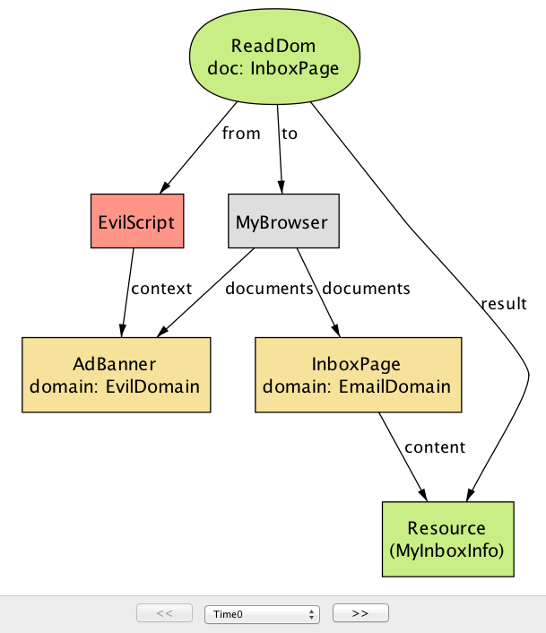

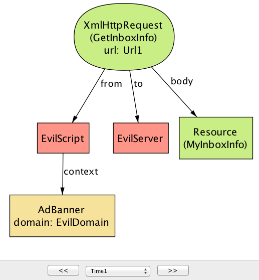

This counterexample involves two steps. In the first step (Figure 17.4), `EvilScript`, executing inside `AdBanner` from `EvilDomain`, reads the content of `InboxPage`, which originates from `EmailDomain`. In the next step (Figure 17.5), `EvilScript` sends the same content (`MyInboxInfo`) to `EvilServer` by making an `XmlHtttpRequest` call. The core of the problem here is that a script executing under one domain is able to read the content of a document from another domain; as we will see in the next section, this is exactly one of the scenarios that the SOP is designed to prevent.

这个反例涉及两个步骤。在第一步骤（图17.4）， EvilScript，内部执行AdBanner从EvilDomain，读取的内容InboxPage，它从始发EmailDomain。在下一步（图17.5）中，EvilScript通过进行XmlHtttpRequest调用向EmilServer发送相同的内容（MyInboxInfo）。这里的核心问题是，在一个域下执行的脚本能够从另一个域读取文档的内容; 正如我们将在下一节中看到的，这正是SOP旨在防止的情景之一。

There may be multiple counterexamples to a single assertion. Consider Figure 17.6, which shows a different way in which the system may violate the confidentiality property.

单个断言可能有多个反例。考虑图17.6，它显示了系统可能违反机密性质的不同方式。

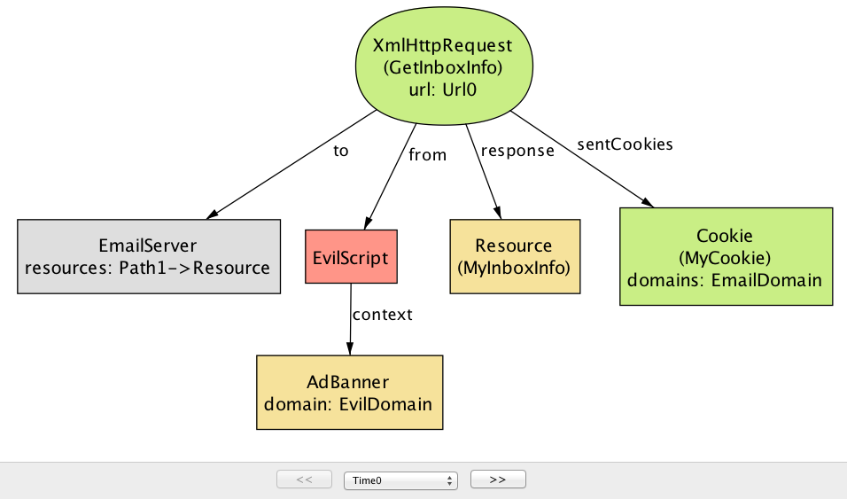

In this scenario, instead of reading the content of the inbox page, `EvilScript` directly makes a `GetInboxInfo` request to `EmailServer`. Note that the request includes a cookie (`MyCookie`), which is scoped to the same domain as the destination server. This is potentially dangerous, because if the cookie is used to represent the user's identity (e.g., a session cookie), `EvilScript` can effectively pretend to be the user and trick the server into responding with the user's private data (`MyInboxInfo`). Here, the problem is again related to the liberal ways in which a script may be used to access information across different domains—namely, that a script executing under one domain is able to make an HTTP request to a server with a different domain.

在这种情况下，EvilScript直接发出GetInboxInfo请求，而不是阅读收件箱页面的内容EmailServer。请注意，请求包括一个cookie（MyCookie），该cookie（）作用域与目标服务器的域相同。这是潜在的危险，因为如果cookie用于表示用户的身份（例如，会话cookie），EvilScript则可以有效地伪装成用户，并欺骗服务器响应用户的私有数据（MyInboxInfo）。在这里，问题再次与脚本可用于访问跨不同域的信息的自由方式相关，即，在一个域下执行的脚本能够向具有不同域的服务器发出HTTP请求。

These two counterexamples tell us that extra measures are needed to restrict the behavior of scripts, especially since some of those scripts could be malicious. This is exactly where the SOP comes in.

这两个反例告诉我们，需要额外的措施来限制脚本的行为，特别是因为其中一些脚本可能是恶意的。这正是SOP进入的地方。

### Same-Origin Policy ###

同源策略

Before we can state the SOP, the first thing we should do is to introduce the notion of an *origin*, which is composed of a protocol, host, and optional port:

在我们可以说明SOP之前，我们首先要做的是介绍一个源代码的概念，它由协议，主机和可选端口组成：

    sig Origin {
      protocol: Protocol,
      host: Domain,
      port: lone Port
    }
For convenience, let us define a function that, given a URL, returns the corresponding origin:

为方便起见，让我们定义一个函数，给定一个URL，返回相应的来源：

    fun origin[u: Url] : Origin {
    {o: Origin | o.protocol = u.protocol and o.host = u.host and o.port = u.port }
    }
The SOP itself has two parts, restricting the ability of a script to (1) make DOM API calls and (2) send HTTP requests. The first part of the policy states that a script can only read from and write to a document that comes from the same origin as the script:

SOP本身有两个部分，限制脚本的能力（1）进行DOM API调用，（2）发送HTTP请求。策略的第一部分指出，脚本只能读取和写入与脚本相同来源的文档：

    fact domSop {
      all o: ReadDom + WriteDom |  let target = o.doc, caller = o.from.context |
    origin[target] = origin[caller] 
    }
An instance such as the first script scenario (from the previous section) is not possible under domSop, since Script is not allowed to invoke ReadDom on a document from a different origin.

诸如第一个脚本场景（从上一节）的实例是不可能的domSop，因为Script不允许ReadDom在不同来源的文档上调用。

The second part of the policy says that a script cannot send an HTTP request to a server unless its context has the same origin as the target URL—effectively preventing instances such as the second script scenario.

策略的第二部分说，脚本无法向服务器发送HTTP请求，除非其上下文与目标URL具有相同的来源 - 有效地防止了诸如第二个脚本场景之类的实例。

    fact xmlHttpReqSop { 
      all x: XmlHttpRequest | origin[x.url] = origin[x.from.context.src] 
    }
As we can see, the SOP is designed to prevent the two types of vulnerabilities that could arise from actions of a malicious script; without it, the web would be a much more dangerous place than it is today.

我们可以看到，SOP旨在防止可能由恶意脚本的行为引起的两种类型的漏洞; 没有它，网络将是一个比今天更危险的地方。

It turns out, however, that the SOP can be too restrictive. For example, sometimes you do want to allow communication between two documents of different origins. By the above definition of an origin, a script from `foo.example.com` would not be able to read the content of `bar.example.com`, or send a HTTP request to `www.example.com`, because these are all considered distinct hosts.

然而事实证明，SOP可能太限制了。例如，有时您确实希望允许不同来源的两个文档之间的通信。通过上述原点的定义，脚本foo.example.com将无法读取内容bar.example.com或发送HTTP请求www.example.com，因为这些都被视为不同的主机。

In order to allow some form of cross-origin communication when necessary, browsers implemented a variety of mechanisms for relaxing the SOP. Some of these are more well-thought-out than others, and some have pitfalls that, when badly used, can undermine the security benefits of the SOP. In the following sections, we will describe the most common of these mechanisms, and discuss their potential security pitfalls.

为了在必要时允许某种形式的跨源通信，浏览器实现了放松SOP的各种机制。其中一些比其他一些更为深思熟虑，有些则陷入困境，如果使用不当，可能会破坏SOP的安全利益。在以下部分中，我们将介绍最常见的机制，并讨论其潜在的安全隐患。

### Techniques for Bypassing the SOP ###

绕过SOP的技术

The SOP is a classic example of the tension between functionality and security; we want to make sure our sites are robust and functional, but the mechanism for securing it can sometimes get in the way. Indeed, when the SOP was initially introduced, developers ran into trouble building sites that made legitimate uses of cross-domain communication (e.g., mashups).

SOP是功能和安全之间紧张关系的典型例子; 我们希望确保我们的网站健壮和功能齐全，但是有时会妨碍其安全的机制。事实上，当SOP最初被引入时，开发人员遇到了构建跨域通信合法使用的站点的麻烦（如mashup）。

In this section, we will discuss four techniques that have been devised and frequently used by web developers to bypass the restrictions imposed by the SOP: (1) The `document.domain` property relaxation; (2) JSONP; (3) PostMessage; and (4) CORS. These are valuable tools, but if used without caution, may render a web application vulnerable to exactly the kinds of attacks that the SOP was designed to thwart in the first place.

在本节中，我们将讨论Web开发人员设计和经常使用的四种技术，以绕过SOP施加的限制：（1）document.domain财产放松; （2）JSONP; （3）邮寄; 和（4）CORS。这些是有价值的工具，但是如果使用时不小心，可能会使Web应用程序容易受到SOP旨在挫败的各种攻击。

Each of these four techniques is surprisingly complex, and if described in full detail, would merit its own chapter. So here we just give a brief impression of how they work, potential security problems that they introduce, and how to prevent these problems. In particular, we will ask the Alloy Analyzer to check, for each technique, whether it could be abused by an attacker to undermine the two security properties that we defined earlier:

这四种技术中的每一种都是令人惊讶的复杂的，如果充分详细描述，则值得自己的一章。所以在这里我们只是给出一个简短的印象，说明它们如何工作，潜在的安全问题，他们介绍，以及如何防止这些问题。特别是，我们将要求合金分析仪检查每种技术是否可以被攻击者滥用以破坏我们之前定义的两个安全属性：

    check Confidentiality for 5
    check Integrity for 5
Based on insights from the counterexamples that the analyzer generates, we will discuss guidelines for safely using these techniques without falling into security pitfalls.

基于分析仪生成的反例的见解，我们将讨论安全使用这些技术的准则，而不会陷入安全隐患。

### Domain Property ###

域属性

As the first technique on our list, we will look at the use of the `document.domain` property as a way of bypassing the SOP. The idea behind this technique is to allow two documents from different origins to access each other's DOM simply by setting the `document.domain` property to the same value. So, for example, a script from `email.example.com` could read or write the DOM of a document from `calendar.example.com` if the scripts in both documents set the document.domain property to `example.com` (assuming both source URLs have also the same protocol and port).

作为我们列表中的第一个技术，我们将会将该document.domain属性的使用视为绕过SOP的一种方式。这种技术背后的想法是允许来自不同来源的两个文档通过将document.domain属性设置为相同的值来访问彼此的DOM 。因此，例如，脚本email.example.com可以读取或写入文档的DOM，calendar.example.com如果两个文档中的脚本将document.domain属性设置为example.com（假设两个源URL也具有相同的协议和端口）。

We model the behavior of setting the `document.domain` property as a type of browser operation called `SetDomain`:

我们模拟将document.domain属性设置为一种浏览器操作的行为SetDomain：

    // Modify the document.domain property
    sig SetDomain extends BrowserOp { newDomain: Domain }{
      doc = from.context
      domain.end = domain.start ++ doc -> newDomain
      -- no change to the content of the document
      content.end = content.start
    }
The `newDomain` field represents the value to which the property should be set. There's a caveat, though: scripts can only set the domain property to a right-hand, fully qualified fragment of its hostname. (I.e., `email.example.com` can set it to `example.com` but not to `google.com`.) We use a fact to capture this rule about subdomains:

该newDomain字段表示属性应设置的值。有一个警告：脚本只能将域属性设置为其主机名的右侧，完全限定的片段。（即，email.example.com可以设置为example.com但不是google.com。）我们使用一个事实来捕获关于子域的这个规则：

    // Scripts can only set the domain property to only one that is a right-hand,
    // fully-qualified fragment of its hostname
    fact setDomainRule {
      all d: Document | d.src.host in (d.domain.Time).subsumes
    }
If it weren't for this rule, any site could set the `document.domain` property to any value, which means that, for example, a malicious site could set the domain property to your bank domain, load your bank account in an iframe, and (assuming the bank page has set its domain property) read the DOM of your bank page.

如果不是这个规则，任何网站都可以将该document.domain属性设置为任何值，这意味着，例如，恶意网站可以将域名属性设置为您的银行域，将您的银行帐户加载到iframe中，（假设银行页面已设置其域属性）读取您的银行页面的DOM。

Let us go back to our original definition of the SOP, and relax its restriction on DOM access in order to take into account the effect of the `document.domain` property. If two scripts set the property to the same value, and they have the same protocol and port, then these two scripts can interact with each other (that is, read and write each other's DOM).

让我们回到我们对SOP的原始定义，并放宽对DOM访问的限制，以便考虑到该document.domain属性的影响。如果两个脚本将属性设置为相同的值，并且它们具有相同的协议和端口，则这两个脚本可以相互交互（即，读取和写入对方的DOM）。

    fact domSop {
      -- For every successful read/write DOM operation,
      all o: ReadDom + WriteDom |  let target = o.doc, caller = o.from.context |
    -- (1) target and caller documents are from the same origin, or
    origin[target] = origin[caller] or
    -- (2) domain properties of both documents have been modified
    (target + caller in (o.prevs <: SetDomain).doc and
      -- ...and they have matching origin values.
      currOrigin[target, o.start] = currOrigin[caller, o.start])
    }
Here, `currOrigin[d, t]` is a function that returns the origin of document d with the property `document.domain` at time `t` as its hostname.

这里currOrigin[d, t]是一个函数，它返回文件的起始位置，其时间d的属性为其主机名。document.domaint

It is worth pointing out that the `document.domain` properties for both documents must be explictly set sometime after they are loaded into the browser. Let us say that document A is loaded from `example.com`, and document B from `calendar.example.com` has its domain property modified to `example.com`. Even though the two documents now have the same domain property, they will not be able to interact with each other, unless document A also explictly sets its property to `example.com`. At first, this seems like a rather strange behavior. However, without this, various bad things can happen. For example, a site could be subject to a cross-site scripting attack from its subdomains: A malicious script in document B might modify its domain property to `example.com` and manipulate the DOM of document A, even though the latter never intended to interact with document B.

这是值得指出的是，document.domain房产两文件必须显式地设置有时它们被加载到浏览器之后。让我们说文档A从...加载example.com，文档B calendar.example.com从其域属性修改为example.com。即使这两个文件现在具有相同的域属性，它们将无法相互交互，除非文档A也明确地将其属性设置为example.com。起初，这似乎是一个很奇怪的行为。但是，如果没有，可能会发生各种不利的事情。例如，站点可能会受到其子站点的跨站点脚本攻击：文档B中的恶意脚本可能会将其域属性修改为example.com并处理文档A的DOM，

**Analysis:** Now that we have relaxed the SOP to allow cross-origin communication under certain circumstances, do the security guarantees of the SOP still hold? Let us ask the Alloy Analyzer to tell us whether the `document.domain` property could be abused by an attacker to access or tamper with a user's sensitive data.

分析：现在我们已经放宽了SOP，允许在某些情况下进行跨原籍交流，SOP的安全保障是否仍然保持？让我们询问合金分析仪告诉我们这个document.domain属性是否可以被攻击者滥用以访问或篡改用户的敏感数据。

Indeed, given the new, relaxed definition of the SOP, the analyzer generates a counterexample scenario to the confidentiality property:

实际上，考虑到SOP的新的，轻松的定义，分析器会为机密性产生一个反例场景：

    check Confidentiality for 5
This scenario consists of five steps; the first three steps show a typical use of `document.domain`, where two documents from distinct origins, `CalendarPage` and `InboxPage`, communicate by setting their domain properties to a common value (`ExampleDomain`). The last two steps introduce another document, BlogPage, that has been compromised with a malicious script that attempts to access the content of the other two documents.

这种情况包括五个步骤; 前三个步骤显示了document.domain两个来自不同起源的文档的典型用法，CalendarPage并InboxPage通过将其域属性设置为公共值（ExampleDomain）来进行通信。最后两个步骤介绍了另一个文档，BlogPage它已经被恶意脚本损坏，试图访问其他两个文档的内容。

At the beginning of the scenario (Figure 17.7 and Figure 17.8), `InboxPage` and `CalendarPage` have domain properties with two distinct values (`EmailDomain` and `ExampleDomain`, respectively), so the browser will prevent them from accessing each other's DOM. The scripts running inside the documents (`InboxScript` and `CalendarScript`) each execute the `SetDomain` operation to modify their domain properties to `ExampleDomain` (which is allowed because `ExampleDomain` is a superdomain of the original domain).

在场景开始时（图17.7和图17.8），InboxPage并CalendarPage具有两个不同值（EmailDomain和ExampleDomain分别）的域属性，因此浏览器将阻止它们访问彼此的DOM。文件（InboxScript和CalendarScript）中运行的脚本每个都执行SetDomain操作来修改它们的域属性ExampleDomain（由于ExampleDomain是原始域的超级域）允许的脚本。

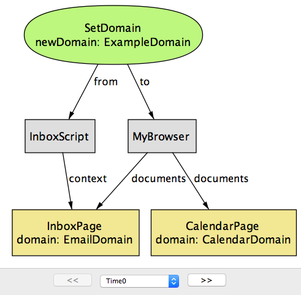

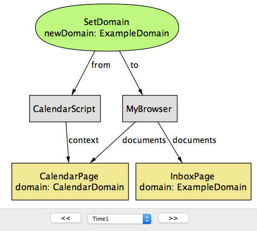

Having done this, they can now access each other's DOM by executing ReadDom or `WriteDom` operations, as in Figure 17.9.

做到这一点后，他们现在可以通过执行ReadDom或WriteDom操作来访问对方的DOM ，如图17.9所示。

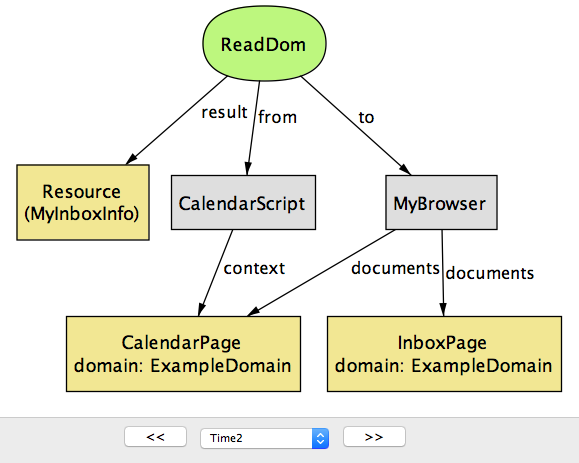

Note that when you set the domain of `email.example.com` and `calendar.example.com` to `example.com`, you are allowing not only these two pages to communicate between each other, but also any other page that has `example.com` as a superdomain (e.g., `blog.example.com`). An attacker also realizes this, and constructs a special script (`EvilScript`) that runs inside the attacker's blog page (`BlogPage`). In the next step (Figure 17.10), the script executes the `SetDomain` operation to modify the domain property of `BlogPage` to `ExampleDomain`.

请注意，当您设置的域email.example.com，并calendar.example.com到example.com，你不仅允许这两个页面相互之间的沟通，同时也任有其他页面example.com的超域（如blog.example.com）。攻击者也意识到这一点，并构建了一个EvilScript在攻击者的博客页面（BlogPage）中运行的特殊脚本（）。在下一步骤（图17.10），脚本执行SetDomain修改的域属性操作BlogPage到ExampleDomain。

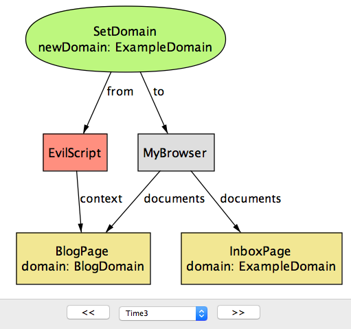

Now that `BlogPage` has the same domain property as the other two documents, it can successfully execute the `ReadDOM` operation to access their content (Figure 17.11.)

现在BlogPage具有与其他两个文档相同的域属性，可以成功执行ReadDOM操作以访问其内容（图17.11。）

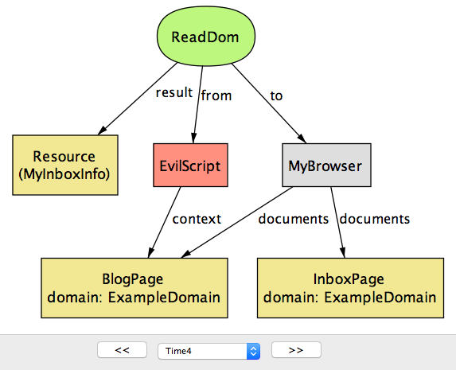

This attack points out one crucial weakness of the domain property method for cross-origin communication: The security of an application that uses this method is only as strong as the weakest link in all of the pages that share the same base domain. We will shortly discuss another method called PostMessage, which can be used for a more general class of cross-origin communication while also being more secure.

这种攻击指出了跨源通信的域属性方法的一个关键弱点：使用此方法的应用程序的安全性与所有共享相同基础域的页面中最薄弱的链接一样强大。我们将尽快讨论另一种称为PostMessage的方法，它可以用于更一般的跨原始通信类，同时也更安全。

### JSON with Padding (JSONP) ###

带填充的JSON（JSONP）

Before the introduction of CORS (which we will discuss shortly), JSONP was perhaps the most popular technique for bypassing the SOP restriction on XMLHttpRequest, and still remains widely used today. JSONP takes advantage of the fact that script inclusion tags in HTML (i.e.,` 
A script tag can be used to obtain code, but how do we use it to receive arbitrary data (e.g., a JSON object) from a different domain? The problem is that the browser expects the content of `src` to be a piece of JavaScript code, and so simply having it point at a data source (e.g., a JSON or HTML file) results in a syntax error.

脚本标签可以用来获取代码，但是我们如何使用它来接收来自不同域的任意数据（例如JSON对象）？问题是浏览器希望内容src成为一个JavaScript代码，因此简单地将其指向数据源（例如，JSON或HTML文件）会导致语法错误。

One workaround is to wrap the desired data inside a string that the browser recognizes as valid JavaScript code; this string is sometimes called padding (hence the name "JSON with padding"). This padding could be any arbitrary JavaScript code, but conventionally, it is the name of a callback function (already defined in the current document) that is to be executed on the response data:

一种解决方法是将浏览器识别为字符串的所需数据包装为有效的JavaScript代码; 这个字符串有时称为填充（因此名称为“JSON with padding”）。这个填充可以是任何任意的JavaScript代码，但是通常来说，它是在响应数据上执行的回调函数（在当前文档中已经定义）的名称：

    
The server on `www.example.com` recognizes it as a JSONP request, and wraps the requested data inside the `jsonp` parameter:

服务器将其www.example.com识别为JSONP请求，并将请求的数据包装在jsonp参数中：

    processData(mydata)
which is a valid JavaScript statement (namely, the application of function "processData" on value "mydata"), and is executed by the browser in the current document.

这是一个有效的JavaScript语句（即在“mydata”上应用函数“processData”），并由当前文档中的浏览器执行。

In our model, JSONP is modeled as a kind of HTTP request that includes the identifier of a callback function in the field `padding`. After receiving a JSONP request, the server returns a response that has the requested resource (`payload`) wrapped inside the callback function (`cb`).

在我们的模型中，JSONP被建模为一种HTTP请求，其中包含“padding”字段中回调函数的标识符。 在收到JSONP请求后，服务器返回一个包含回调函数（`cb`）内的请求资源（`payload`）的响应。

    sig CallbackID {}  // identifier of a callback function
    // Request sent as a result of <script> tag
    sig JsonpRequest in BrowserHttpRequest {
      padding: CallbackID
    }{
      response in JsonpResponse
    }
    sig JsonpResponse in Resource {
      cb: CallbackID,
      payload: Resource
    }
When the browser receives the response, it executes the callback function on the payload:

当浏览器收到响应时，它会在有效载荷上执行回调函数：

    sig JsonpCallback extends EventHandler {
      cb: CallbackID,
      payload: Resource
    }{
      causedBy in JsonpRequest
      let resp = causedBy.response | 
    cb = resp.@cb and
    -- result of JSONP request is passed on as an argument to the callback
    payload = resp.@payload
    }
(`EventHandler` is a special type of call that must take place sometime after another call, which is denoted by `causedBy`; we will use event handlers to model actions that are performed by scripts in response to browser events.)

（EventHandler是一种特殊类型的调用，必须在另一个调用之后的某个时间进行，由...表示causedBy;我们将使用事件处理程序来模拟脚本响应浏览器事件执行的操作。）

Note that the callback function executed is the same as the one that's included in the response (`cb = resp.@cb`), but not necessarily the same as `padding` in the original JSONP request. In other words, for the JSONP communication to work, the server is responsible for properly constructing a response that includes the original padding as the callback function (i.e., ensure that `JsonRequest.padding = JsonpResponse.cb`). In principle, the server can choose to include any callback function (or any piece of JavaScript), including one that has nothing to do with `padding` in the request. This highlights a potential risk of JSONP: the server that accepts the JSONP requests must be trustworthy and secure, because it has the ability to execute any piece of JavaScript code in the client document.

请注意，执行的回调函数与response（cb = resp.@cb）中包含的回调函数相同，但不一定padding与原始JSONP请求相同。换句话说，为了使JSONP通信正常工作，服务器负责正确构建包含原始填充作为回调函数的响应（即确保JsonRequest.padding = JsonpResponse.cb）。原则上，服务器可以选择包括任何回调函数（或任何JavaScript），包括与padding请求无关的函数。这突出了JSONP的潜在风险：接受JSONP请求的服务器必须是可靠和安全的，因为它可以在客户端文档中执行任何JavaScript代码。

**Analysis:** Checking the `Confidentiality` property with the Alloy Analyzer returns a counterexample that shows one potential security risk of JSONP. In this scenario, the calendar application (`CalendarServer`) makes its resources available to third-party sites using a JSONP endpoint (`GetSchedule`). To restrict access to the resources, `CalendarServer` only sends back a response with the schedule for a user if the request contains a cookie that correctly identifies that user.

分析：Confidentiality使用合金分析仪检查属性返回一个反例，显示JSONP的一个潜在安全风险。在这种情况下，日历应用程序（CalendarServer）使用JSONP端点（GetSchedule）使其资源可用于第三方站点。要限制对资源的访问，CalendarServer只有当请求包含正确标识该用户的cookie时，才会向用户发回具有调度表的响应。

Note that once a server provides an HTTP endpoint as a JSONP service, anyone can make a JSONP request to it, including malicious sites. In this scenario, the ad banner page from `EvilServer` includes a *script* tag that causes a `GetSchedule` request, with a callback function called `Leak` as `padding`. Typically, the developer of `AdBanner` does not have direct access to the victim user's session cookie (`MyCookie`) for `CalendarServer`. However, because the JSONP request is being sent to `CalendarServer`, the browser automatically includes `MyCookie` as part of the request; `CalendarServer`, having received a JSONP request with `MyCookie`, will return the victim's resource (`MySchedule`) wrapped inside the padding `Leak` (Figure 17.12.)

请注意，一旦服务器将HTTP端点提供为JSONP服务，任何人都可以向其提供JSONP请求，包括恶意站点。 在这种情况下，“EvilServer”中的广告横幅页面包含一个*脚本*标签，导致“GetSchedule”请求，一个名为“泄漏”的回调函数为“padding”。 通常，“AdBanner”的开发人员不能直接访问受害者用户的会话cookie（“MyCookie”）用于“CalendarServer”。 但是，由于JSONP请求被发送到“CalendarServer”，浏览器会自动将“MyCookie”作为请求的一部分， `CalendarServer`已经收到了一个“MyCookie”的JSONP请求，将返回被填充的“泄漏”中的受害者的资源（“MySchedule”）（图17.12）。

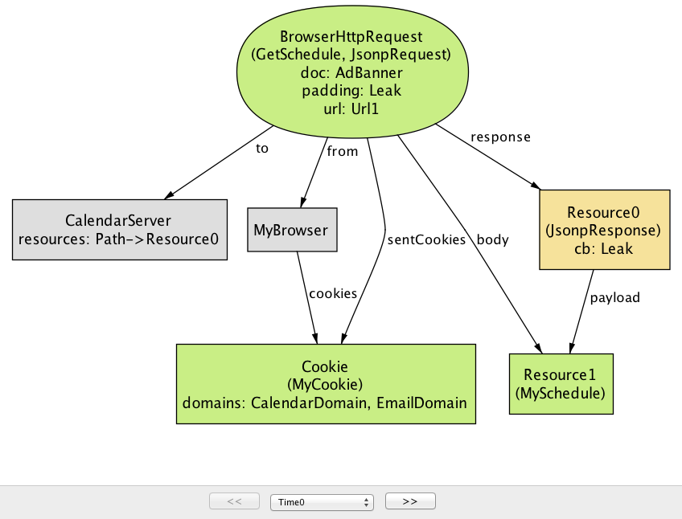

In the next step, the browser interprets the JSONP response as a call to `Leak(MySchedule)` (Figure 17.13). The rest of the attack is simple; Leak can simply be programmed to forward the input argument to `EvilServer`, allowing the attacker to access the victim's sensitive information.

在下一步中，浏览器将JSONP响应解释为调用Leak(MySchedule)（图17.13）。其余的攻击很简单; Leak可以简单地编程为转发输入参数EvilServer，允许攻击者访问受害者的敏感信息。

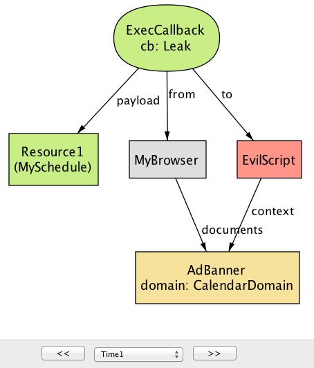

This attack, an example of *cross-site request forgery* (CSRF), shows an inherent weakness of JSOPN; any site on the web can make a JSONP request simply by including a `<script>` tag and access the payload inside the padding. The risk can be mitigated in two ways: (1) ensure that a JSONP request never returns sensitive data, or (2) use another mechanism in place of cookies (e.g., secret tokens) to authorize the request.

这种攻击是跨站点请求伪造（CSRF）的示例，显示了JSOPN的固有缺陷; Web上的任何网站都可以通过添加<script>标签并在填充内部访问有效内容来简单地制作JSONP请求。风险可以通过两种方式得到缓解：（1）确保JSONP请求不会返回敏感数据，或者（2）使用另一种机制代替cookie（例如秘密令牌）来授权请求​​。

### PostMessage ###

PostMessage

PostMessage is a new feature in HTML5 that allows scripts from two documents (of possibly different origins) to communicate with each other. It offers a more disciplined alternative to the method of setting the `domain` property, but brings its own security risks.

PostMessage是HTML5中的一项新功能，允许来自两个文档（可能不同的起源）的脚本相互通信。它为设置domain财产的方式提供了更有条理的替代方法，但却带来了自身的安全隐患。

`PostMessage` is a browser API function that takes two arguments: (1) the data to be sent (`message`), and (2) the origin of the document receiving the message (`targetOrigin`):

PostMessage是一个浏览器API函数，它有两个参数：（1）要发送的数据（message）和（2）接收消息的文档的原点（targetOrigin）：

    sig PostMessage extends BrowserOp {
      message: Resource,
      targetOrigin: Origin
    }
To receive a message from another document, the receiving document registers an event handler that is invoked by the browser as a consequence of a `PostMessage`:

要从另一个文档接收消息，接收文件会注册浏览器调用的事件处理程序，结果是PostMessage：

    sig ReceiveMessage extends EventHandler {
      data: Resource,
      srcOrigin: Origin
    }{
      causedBy in PostMessage
      -- "ReceiveMessage" event is sent to the script with the correct context
      origin[to.context.src] = causedBy.targetOrigin
      -- messages match
      data = causedBy.@message
      -- the origin of the sender script is provided as "srcOrigin" param 
      srcOrigin = origin[causedBy.@from.context.src]
    }
The browser passes two parameters to ReceiveMessage: a resource (`data`) that corresponds to the message being sent, and the origin of the sender document (`srcOrigin`). The signature fact contains four constraints to ensure that each `ReceiveMessage` is well-formed with respect to its corresponding `PostMessage`.

浏览器将两个参数传递给ReceiveMessage：与data要发送的消息相对应的资源（）和发送者文档（srcOrigin）的原点。签名事实包含四个约束，以确保每个ReceiveMessage约束对其相应的形状都很好PostMessage。

**Analysis**: Again, let us ask the Alloy Analyzer whether PostMessage is a secure way of performing cross-origin communication. This time, the analyzer returns a counterexample for the `Integrity` property, meaning the attacker is able to exploit a weakness in `PostMessage` to introduce malicious data into a trusted application.

分析：再次，让我们询问合金分析仪是否PostMessage是一种执行跨原始通信的安全方式。这次，分析器返回Integrity属性的反例，这意味着攻击者能够利用弱点PostMessage将恶意数据引入受信任的应用程序。

Note that by default, the PostMessage mechanism does not restrict who is allowed to send PostMessage; in other words, any document can send a message to another document as long as the latter has registered a `ReceiveMessage` handler. For example, in the following instance generated from Alloy, `EvilScript`, running inside `AdBanner`, sends a malicious `PostMessage` to a document with the target origin of `EmailDomain` (Figure 17.14.)

请注意，默认情况下，PostMessage机制不限制允许发送PostMessage的人员; 换句话说，只要后者已经注册了ReceiveMessage处理程序，任何文档都可以发送消息到另一个文档。例如，在由Alloy生成的以下实例中EvilScript，在内部运行时AdBanner，将恶意发送PostMessage到具有目标原点的文档EmailDomain（图17.14。）

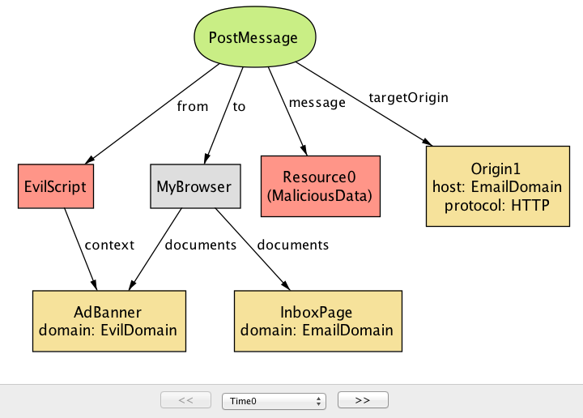

The browser then forwards this message to the document(s) with the corresponding origin (in this case, `InboxPage`). Unless `InboxScript` specifically checks the value of `srcOrigin` to filter out messages from unwanted origins, `InboxPage` will accept the malicious data, possibly leading to further security attacks. (For example, it may embed a piece of JavaScript to carry out an XSS attack.) This is shown in Figure 17.14.

然后，浏览器将该消息转发到具有相应来源（在这种情况下InboxPage）的文档。除非InboxScript特别检查srcOrigin从不需要的来源过滤消息的值，否则InboxPage将接受恶意数据，可能导致进一步的安全攻击。（例如，它可能嵌入一个JavaScript来执行XSS攻击）。如图17.14所示。

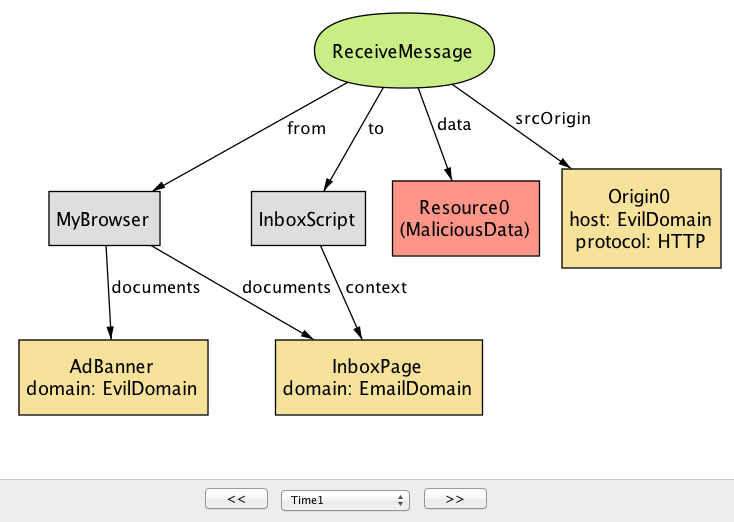

As this example illustrates, `PostMessage` is not secure by default, and it is the responsibility of the receiving document to *additionally* check the srcOrigin parameter to ensure that the message is coming from a trustworthy document. Unfortunately, in practice, many sites omit this check, enabling a malicious document to inject bad content as part of a `PostMessage`.

如该示例所示，PostMessage默认情况下不安全，接收文档有责任额外检查srcOrigin参数以确保该消息来自可信赖的文档。不幸的是，在实践中，许多网站省略了这个检查，使恶意文件能够将不良内容注入PostMessage。

However, the omission of the origin check may not simply be the result of programmer ignorance. Implementing an appropriate check on an incoming PostMessage can be tricky; in some applications, it is hard to determine in advance the list of trusted origins from which messages are expected to be received. (In some apps, this list may even change dynamically.) This, again, highlights the tension between security and functionality: PostMessage can be used for secure cross-origin communication, but only when a whitelist of trusted origins is known.

然而，省略原始检查可能不仅仅是程序员无知的结果。对传入的PostMessage执行适当的检查可能很棘手; 在某些应用中，难以预先确定可接收消息的可信来源列表。（在某些应用程序中，此列表甚至可能会动态更改。）同样，这突出显示了安全性和功能性之间的紧张关系：PostMessage可用于安全的跨原始通信，但仅当已知可信来源的白名单时。

### Cross-Origin Resource Sharing (CORS) ###

跨原始资源共享（CORS）

Cross-Origin Resource Sharing (CORS) is a mechanism designed to allow a server to share its resources with sites from different origins. In particular, CORS can be used by a script from one origin to make requests to a server with a different origin, effectively bypassing the restriction of the SOP on cross-origin Ajax requests.

跨原始资源共享（CORS）是一种旨在允许服务器与来自不同来源的站点共享其资源的机制。特别地，CORS可以由来自一个来源的脚本用于向具有不同来源的服务器发出请求，有效地绕过了跨原始Ajax请求的SOP限制。

Briefly, a typical CORS process involves two steps: (1) a script wanting to access a resource from a foreign server includes, in its request, an "Origin" header that specifies the origin of the script, and (2) the server includes an "Access-Control-Allow-Origin" header as part of its response, indicating a set of origins that are allowed to access the server's resource. Normally, without CORS, a browser would prevent the script from making a cross-origin request in the first place, conforming to the SOP. However, with CORS enabled, the browser allows the script to send the request and access its response, but *only if* "Origin" is one of the origins specified in "Access-Control-Allow-Origin".

简单来说，典型的CORS过程包括两个步骤：（1）希望从外部服务器访问资源的脚本在其请求中包括指定脚本的起源的“Origin”头，以及（2）服务器包括“Access-Control-Allow-Origin”标头作为其响应的一部分，指示允许访问服务器资源的一组源。通常，没有CORS，浏览器将阻止脚本首先发出符合SOP的跨原始请求。然而，启用CORS后，浏览器允许脚本发送请求并访问其响应，但只有当 “Origin”是“Access-Control-Allow-Origin”中指定的源中之一时才允许。

(CORS additionally includes a notion of preflight requests, not discussed here, to support complex types of cross-origin requests besides GETs and POSTs.)

（除了GETs和POST之外，CORS还包括一个前瞻性请求概念，这里不讨论这些概念来支持复杂类型的跨原始请求。）

In Alloy, we model a CORS request as a special kind of `XmlHttpRequest`, with two extra fields `origin` and `allowedOrigins`:

在合金中，我们模拟一个CORS请求作为一种特殊的XmlHttpRequest，有两个额外的字段origin和allowedOrigins：

    sig CorsRequest in XmlHttpRequest {
      -- "origin" header in request from client
      origin: Origin,
      -- "access-control-allow-origin" header in response from server
      allowedOrigins: set Origin
    }{
      from in Script
    }
We then use an Alloy fact corsRule to describe what constitutes a valid CORS request:

然后，我们使用Alloy事实corsRule来描述什么构成有效的CORS请求：

    fact corsRule {
      all r: CorsRequest |
    -- the origin header of a CORS request matches the script context
    r.origin = origin[r.from.context.src] and
    -- the specified origin is one of the allowed origins
    r.origin in r.allowedOrigins
    }
**Analysis:** Can CORS be misused in a way that would allow the attacker to compromise the security of a trusted site? When prompted, the Alloy Analyzer returns a simple counterexample for the `Confidentiality` property.

分析： CORS可能会以允许攻击者破坏受信任站点的安全性的方式被误用？出现提示时，“合金分析仪”会返回Confidentiality属性的简单反例。

Here, the developer of the calendar application decides to share some of its resources with other applications by using the CORS mechanism. Unfortunately, `CalendarServer` is configured to return Origin (which represents the set of all origin values) for the `access-control-allow-origin` header in CORS responses. As a result, a script from any origin, including `EvilDomain`, is allowed to make a cross-site request to `CalendarServer` and read its response (Figure 17.16).

在这里，日历应用程序的开发人员决定通过使用CORS机制与其他应用程序共享其一些资源。不幸的CalendarServer是，配置为在CORS响应中返回Origin（表示所有原始值的集合）access-control-allow-origin。因此，任何来源的脚本（包括EvilDomain）都被允许进行跨站点请求CalendarServer并读取其响应（图17.16）。

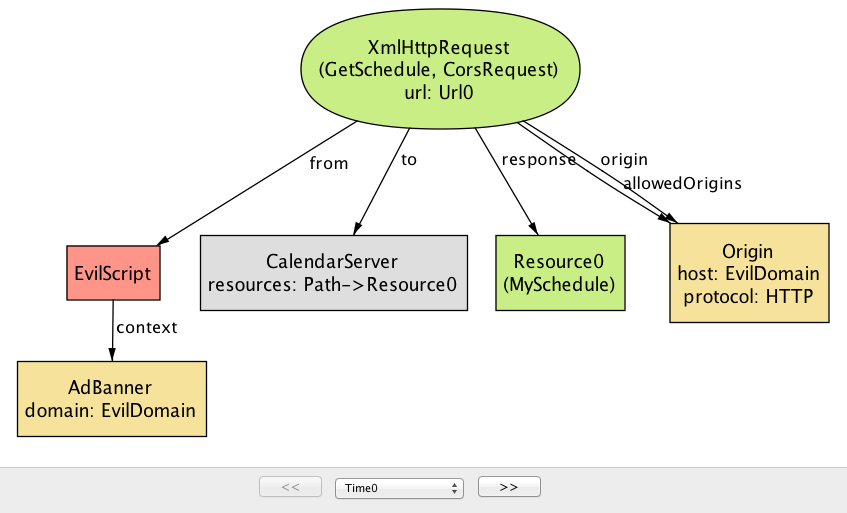

This example highlights one common mistake that developers make with CORS: Using the wildcard value "*" as the value of "access-control-allow-origin" header, allowing any site to access a resource on the server. This access pattern is appropriate if the resource is considered public and accessible to anyone. However, it turns out that many sites use "*" as the default value even for private resources, inadvertently allowing malicious scripts to access them through CORS requests.

此示例突出了开发人员使用CORS的一个常见错误：使用通配符值“*”作为“access-control-allow-origin”标头的值，允许任何站点访问服务器上的资源。如果资源被认为是公开的，并且任何人都可以访问，则该访问模式是适当的。然而，事实证明，即使对于私人资源，许多站点也使用“*”作为默认值，无意中允许恶意脚本通过CORS请求访问它们。

Why would a developer ever use the wildcard? It turns out that specifying the allowed origins can be tricky, since it may not be clear at design time which origins should be granted access at runtime (similar to the PostMessage issue discusssed above). A service may, for example, allow third-party applications to subscribe dynamically to its resources.

为什么开发人员会使用通配符？事实证明，指定允许的来源可能是棘手的，因为在设计时可能不清楚哪个起始应该在运行时被授予访问权限（类似于上面提到的PostMessage问题）。例如，服务可以允许第三方应用程序动态地订阅其资源。

### Conclusion ###

结论

In this chapter, we set out to construct a document that provides a clear understanding of the SOP and its related mechanisms by building a model of the policy in a language called Alloy. Our model of the SOP is not an implementation in the traditional sense, and can't be deployed for use, unlike artifacts shown in other chapters. Instead, we wanted to demonstrate the key elements behind our approach to "agile modeling": (1) starting out with a small, abstract model of the system and *incrementally* adding details as necessary, (2) specifying *properties* that the system is expected to satisfy, and (3) applying *rigorous analysis* to explore potential flaws in the design of the system. Of course, this chapter was written long after the SOP was first introduced, but we believe that this type of modeling would potentially be even more beneficial if it is done during the early stage of system design.

在本章中，我们着手构建一个文档，通过以一种称为“合金”的语言构建一个策略模型，从而对SOP及其相关机制提供了清晰的了解。 我们的SOP模型不是传统意义上的实现，不能像其他章节所示的工件一样部署使用。 相反，我们想要展示我们的“敏捷建模”方法背后的关键要素：（1）从系统的小型抽象模型开始，根据需要*增量*地添加细节，（2）指定*属性* 系统有望满足，（3）应用*严格的分析*来探索系统设计中的潜在缺陷。 当然，这一章是在SOP第一次引入之后写的很久，但是我们认为，如果在系统设计的早期阶段完成这种建模，这种类型的建模可能会更有益处。

Besides the SOP, Alloy has been used to model and reason about a variety of systems across different domains—ranging from network protocols, semantic web, bytecode security to electronic voting and medical systems. For many of these systems, Alloy's analysis led to discovery of design flaws and bugs that had eluded the developers, in some cases, for years. We invite our readers to visit the Alloy page and try building a model of their favorite system!

除了SOP之外，Alloy已被用于对不同领域的各种系统进行建模和推理，从网络协议，语义网，字节码安全到电子投票和医疗系统。对于许多这些系统，Alloy的分析导致发现设计缺陷和错误，在某些情况下，开发人员已经发现了多年。我们邀请读者访问合金页面，并尝试构建自己喜欢的系统的模型！

### Appendix: Reusing Modules in Alloy ###

附录：在合金中重新使用模块

  As mentioned earlier in this chapter, Alloy makes no assumptions about the behavior of the system being modeled. The lack of a built-in paradigm allows the user to encode a wide range of modeling idioms using a small core of the basic language constructs. We could, for example, specify a system as a state machine, a data model with complex invariants, a distributed event model with a global clock, or whatever idiom is most suitable for the problem at hand. Commonly used idioms can be captured as a generic module and reused across multiple systems.

 如本章前面所述，Alloy不会对正在建模的系统的行为进行假设。缺乏内置的范式允许用户使用基本语言结构的小核心对各种建模习语进行编码。例如，我们可以将系统指定为状态机，具有复杂不变量的数据模型，具有全局时钟的分布式事件模型，或任何习惯最适合于当前问题。常用的成语可以被捕获为通用模块，并且可以跨多个系统重用。

In our model of the SOP, we model the system as a set of endpoints that communicate with each other by making one or more calls. Since call is a fairly generic notion, we encapsulate its description in a separate Alloy module, to be imported from other modules that rely on it -- similar to standard libraries in programming languages:

在我们的SOP模型中，我们将系统建模为一组通过进行一个或多个通话相互通信的端点。由于调用是一个相当通用的概念，我们将其描述封装在单独的Alloy模块中，以便从依赖于它的其他模块导入 - 类似于编程语言中的标准库：

    module call[T] 
In this module declaration, `T` represents a type parameter that can be instantiated to a concrete type that is provided when the module is imported. We will soon see how this type parameter is used.

在此模块声明中，T表示可以实例化为在导入模块时提供的具体类型的类型参数。我们将很快看到如何使用此类型参数。

It is often convenient to describe the system execution as taking place over a global time frame, so that we can talk about calls as occurring before or after each other (or at the same time). To represent the notion of time, we introduce a new signature called `Time`:

将系统执行描述为在全球时间框架内进行，通常很方便，因此我们可以将通话视为在彼此之间或之后（或同时）发生。为了代表时间的概念，我们引入一个新的签名Time：

    open util/ordering[Time] as ord
    sig Time {}
In Alloy, `util/ordering` is a built-in module that imposes a total order on the type parameter, and so by importing `ordering[Time]`, we obtain a set of `Time` objects that behave like other totally ordered sets (e.g., natural numbers).

在Alloy中，util/ordering是一个内置的模块，它对类型参数施加了一个完整的顺序，因此通过导入ordering[Time]，我们获得了一组Time行为像其他完全有序集（如自然数）的对象。

Note that there is absolutely nothing special about `Time`; we could have named it any other way (for example, `Step` or `State`), and it wouldn't have changed the behavior of the model at all. All we are doing here is using an additional column in a relation as a way of representing the content of a field at different points in a system execution; for example, `cookies` in the `Browser` signature. In this sense, Time objects are nothing but helper objects used as a kind of index.

请注意，绝对没有什么特别的Time; 我们可以以任何其他方式命名它（例如，Step或State），它根本不会改变模型的行为。我们在这里所做的只是在一个关系中使用一个附加的列来表示系统执行中不同点的一个字段的内容; 例如，cookies在Browser签名。在这个意义上，Time对象只不过是一个用作索引的辅助对象。

Each call occurs between two points in time—its `start` and `end` times, and is associated with a sender (represented by `from`) and a receiver (`to`):

每个呼叫发生在两个时间点之间，它们start和end时间相关联，并且与发送者（由...表示from）和receiver（to）相关联：

    abstract sig Call { start, end: Time, from, to: T } 
Recall that in our discussion of HTTP requests, we imported the module call by passing `Endpoint` as its type parameter. As a result, the parametric type T is instantiated to `Endpoint`, and we obtain a set of `Call` objects that are associated with a pair of sender and receiver endpoints. A module can be imported multiple times; for example, we could declare a signature called `UnixProcess`, and instantiate the module `call` to obtain a distinct set of `Call` objects that are sent from one Unix process to another.

回想一下，在我们讨论HTTP请求时，我们call通过传递Endpoint类型参数来导入模块。因此，参数类型T被实例化Endpoint，并且我们获得Call与一对发送器和接收器端点相关联的一组对象。一个模块可以多次导入; 例如，我们可以声明一个称为的签名UnixProcess，并实例化模块call以获得Call从一个Unix进程发送到另一个Unix进程的一组不同的对象。

***

1.Sooel Son and Vitaly Shmatikov. The `Postman Always Rings Twice: Attacking and Defending postMessage in HTML5 Websites`. Network and Distributed System Security Symposium (NDSS), 2013.

1.Sooel儿子和Vitaly Shmatikov。邮递员总是两次：在HTML5网站中攻击和捍卫postMessage。网络和分布式系统安全研讨会（NDSS），2013年

2.Sebastian Lekies, Martin Johns, and Walter Tighzert. The State of the `Cross-Domain Nation`. Web 2.0 Security and Privacy (W2SP), 2011.

2.Sebastian Lekies，Martin Johns和Walter Tighzert。跨国界的状态。Web 2.0的安全性和保密性（W2SP），2011年